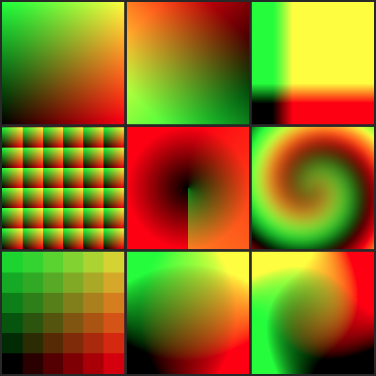
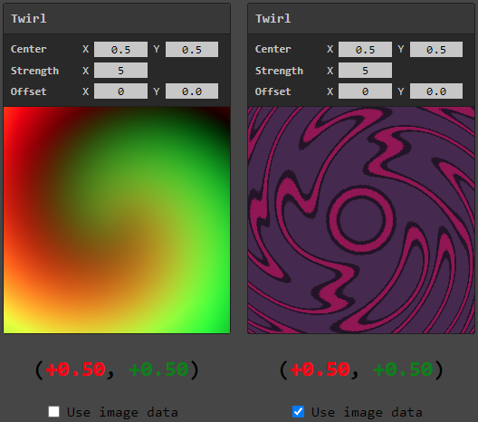

# Year of Unity - August: UV Shader Nodes (Reference)

<p align="center">
  
</p>

Another not-a-game entry! Hooked on exploring shaders from my previous month's post, I decided to continue the trend and look into implementing some basic shader-graph nodes from scratch, entirely in the web. The focus was mainly on the [UV-related](https://docs.unity3d.com/Packages/com.unity.shadergraph@6.9/manual/UV-Nodes.html) nodes within Unity's [shader graph](https://unity.com/features/shader-graph) system, since these don't require mesh or texture data.

Not only is this entry not a game, but it doesn't even include a Unity project. All of the relevant files are in the 'shaders' folder, and can be opened in a browser. Though it only uses the browser, it is based off of the behavior of the shader graph nodes within Unity, so I think it still counts as a 'year-of-unity' entry :p


## Goals
The goal here was really just to play around with the implementation of shaders and the idea of a 'per-pixel' function.

#### Reading out-of-bounds values
For some reason, the single biggest driving factor behind this project was thinking about the ability to read or view shader values when they go out of the display range (i.e. values outside of 0.0 to +1.0), it's something I wish you could do directly in shader graph.

#### Warping images
Seeing how different nodes affect UV data can be pretty interesting, I especially like the _twirl_ node for example. However, some of the nodes do things that look pretty unimpressive when considering UVs alone, so I thought it would be cool to use the distorted UVs to sample from image data, to better visualize the distorting effects. It turns out that some of the scrolling/offset effects are way cooler than I expected, so I'm glad I took the time to look into supporting this. For the image data itself, I also got to implement a [truchet tiling](https://en.wikipedia.org/wiki/Truchet_tiles), which I definitely want to look into in the future!

<p align="center">
  
</p>


#### Extendibility
In the incredibly unlikely event that anyone ever finds this repo _and_ wants to make/modify the shader nodes, I've tried to set up the code to be as easy as possible to extend. The actual implementation is rather hacky as a result, since I lack an understanding of web technologies to do this is a simple modular way, without requiring local servers or special build tools...

Anyways here's an example of the _entire_ script needed to make the `Add` node:

```js
<script>

    class AddNode {

        constructor(ctrl_group) {
            this.add = ctrl_group.add_vector("Value", ["0.0", "0.0"]);
        }

        from_uvs = (u, v) => {

            // Calculate components separate, since we can't do vector operations in js!
            const x_out = u + this.add.x;
            const y_out = v + this.add.y;

            return [x_out, y_out];
        }
    }

    // Handle all GFX setup!
    setup_shader_plot("Add", AddNode);

</script>
```

Basically, one class per uv-modifying shader node. The constructor is used to define the controls of the node (along with default values and optionally a step sizing), and then a single `from_uvs` function is expected, which is where the per-pixel uv-warping logic of the node should be written.

There are a few other boilerplate-y things needed in the full html file, but these can be copy-pasted from an existing file (e.g. from `add_node.html`) to get up and running quick and easily. There are no other requirements! Just modify the class code and open the html file in a browser to view the results.

#### Writing
Continuing from the last YoU entry, I also wanted to do another blog-type write up (the blog looks rather pathetic with only 1 post after all!). The write up is available [here](https://www.litfamiliar.com/posts/uvshadernodes/) and is largely interactive. It includes all of the shader nodes in one page, and features more image data to experiment with.
